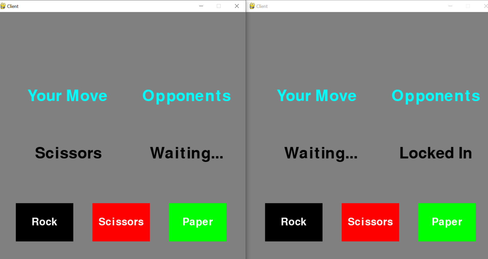
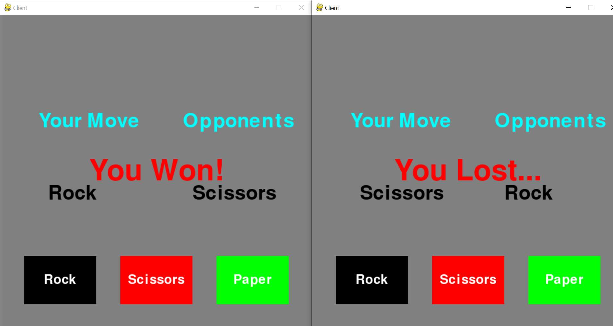

# Rock-Paper-Scissors-Using-Socket-Server
This is a project for the class: 18CSC302J - Computer Networks by Dr. S.Babu

### Contributors
* [Yash Joshi](https://github.com/yashjoshi007) - RA1911003010087
* [Abhijeet Gupta](https://github.com/abhigupta2000) - RA1911003010089
* [Naman Jain](https://github.com/namannj15) - RA1911003010090

## Overview

This is a simple game of rock-paper-scissors developed in Python. It allows two players to play with one another on different command lines through networking. The server starts the game by *first* running `server.py`, waiting for the client to connect by *then* running `client.py`. Once their connected, the game itself starts.

It is a multiplayer game. Two client files has to be executed simultaneously namely `Player 0` and `Player 1`. A player has to make his/her choice from three given option : Rock , Scissors , Paper and same has to be done by another player. According to predefined conditions the result is decided.

<h2 align= "left">Choice</h2>

  
   &ensp;

## Technical Keywords 

### Socket Programming:
Socket programming is a way of connecting two nodes on a network to communicate with each other. One socket(node) listens on a particular port at an IP, while the other socket reaches out to the other to form a connection. The server forms the listener socket while the client reaches out to the server.

### Pygame Library:
The pygame library is an open-source module for the Python programming language specifically intended to help you make games and other multimedia applications. Built on top of the highly portable SDL (Simple DirectMedia Layer) development library, pygame can run across many platforms and operating systems.

### Pickle Module :
Python pickle module is used for serializing and de-serializing a Python object structure. Pickling is a way to convert a python object (list, dict, etc.) into a character stream. The idea is that this character stream contains all the information necessary to reconstruct the object in another python script

<h2 align= "left">Demo</h2>

  
   &ensp;

## Development Environment

* Visual Studio Code
* Git/Github
* Python (3.9.4)64-bit
* Python : Socket , Pygame and Pickle modules
